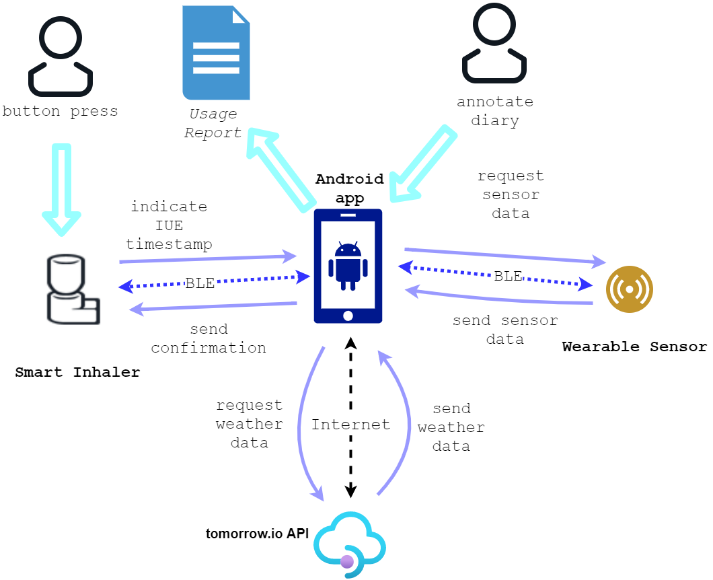

# Smart Asthma-Inhaler

Asthma is a chronic disease of the lungs that affects approximately 25 million Americans. According to the Centers for Disease Control and prevention, without proper management, asthma can result in “frequent emergency department visits, hospitalizations, and premature deaths.”

The goal of this project is to develop, with cooperation with a mechanical engineering (ME) team, a system of devices to help manage Asthma.

This system consists of an Albuterol inhaler, a proof-of-concept wearable sensor (alternatively named smart-pin or pin), and an Android application. The inhaler tracks inhaler usage events (IUE) and transmits them to an Android application via Bluetooth Low Energy (BLE). The wearable sensor allows the Android application to collect temperature, humidity, and Particulate Matter (PM) readings from the immediate surroundings of the patient. The Android application collates and reports this information along with the local environmental data (temperature, Air Quality Index (AQI), humidity, precipitation, and pollen count) for future reference.

## System Design

The above figure shows the interactions of the system's components. The inhaler is activated when the IUE button is pressed, indicating medication usage. The inhaler records the date and time of the IUE and transmits this data to the Android application through BLE.

The Android application requests sensor information from the wearable sensor when the two are connected via BLE. The wearable sensor’s micro-controller unit (MCU) is always active (not in a low power mode) and attempting to connect via BLE to the application if there is no existing connection.

The Android application receives IUE information from the inhaler MCU and sensor data from the smart pin MCU. It gets local weather information from the [tomorrow.io](https://tomorrow.io), a weather RESTful API. The application prompts the user to tag and annotate each IUE to document reasons for use. It saves all IUE date/time and environmental data locally to the phone.
When requested, the application creates a CSV file recording the date and time of IUEs, the environmental factors present during that time, and user annotations and tags.

To learn more about the inhaler, wearable sensor, or the app, please go to its respective page. To Set up your development environment, please go to the getting started page.

## Pages
- [Inhaler](inhaler)
- [Wearable Sensor](wearable_sensor)
- [Android App](android_app)
- [Getting Started](getting_started)
- [Low Power Optimizations and Measurements](low_power)

## Team members

- Youssef Beltagy
- Sarah Panther
- Jennifer Lee
- David Chiang