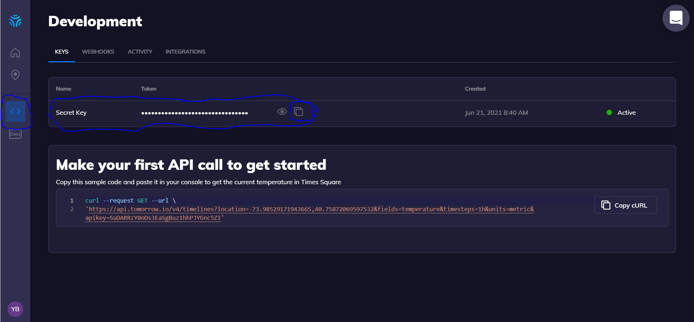
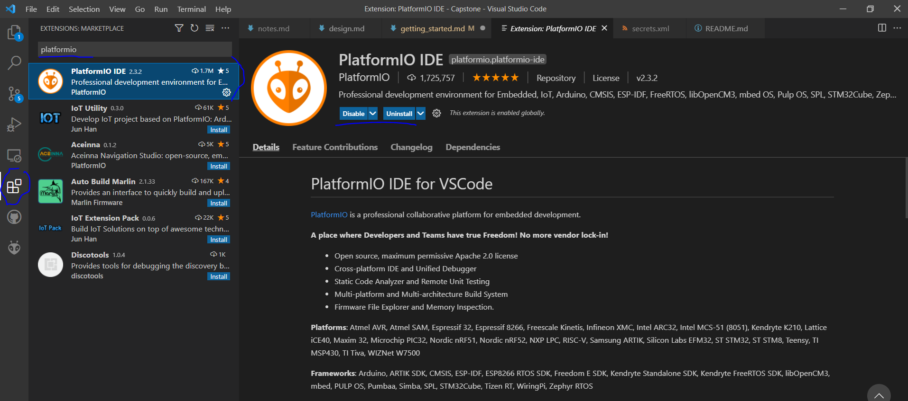

# Getting Started

The system is made of the app, the inhaler, and the wearable. Each one of these is a separate project and needs to be set up independently.

Here are the steps to setup your development environment.

1. Download and install [Git](https://git-scm.com/downloads)
2. (optional) Open Git bash and run these commands with your own name and email 
   1. `git config --global user.name "John Doe"`
   2. `git config --global user.email johndoe@example.com`
3. Make a [Github](https://github.com/) account
4. Make sure you have access to the repository and copy the HTTPS link to clone it 
5. Open Git bash where you want to place the repository and run this command
   1. `git clone repository-url`

Congratulations! You now have the code on your local machine. Please remember to make your own branches when you are collaborating.

## Getting Started with the Android app

You need Android Studio and a tomorrow.io API key. Please be aware we configured the .gitignore file so the api key will be ignored. 

Please follow the following steps to get the API key.

1. Sign up for a [tomorrow.io](https://www.tomorrow.io/weather-api/) account
2. Please go to the developer options and copy the api key 
3. Make a `secrets.xml` file and put your api key in it as you can see below
4. Put `secrets.xml` inside `Breathe\app\src\main\res\values\`

```xml
<?xml version="1.0" encoding="utf-8"?>
<resources>
    <string name="clima_cell_api_key">your-api-key</string>
</resources>
```

Please follow the following steps to setup your Android development environment.

1. Download [Android Studio](https://developer.android.com/studio)
2. Open Android Studio and go to `File > Open` in the toolbar
3. Navigate to where you downloaded the repository, choose the Breathe folder inside the repository, and open the project
4. (optional) sign into your github account through Android Studio
5. You can now build and run your Android project

## Getting Started with the inhaler and wearable

You need STM32CubeIDE to work on the inhaler or the wearable.

1. Download and Install [STM32CubeIDE](https://www.st.com/content/st_com/en/products/development-tools/software-development-tools/stm32-software-development-tools/stm32-ides/stm32cubeide.html)
2. Open STM32CubeIDE and go to `File > Open Projects From File System...` from the toolbar
3. Click the directory button 
4. Navigate to the stm32-smart-inhaler folder, select it, and finish the importing process
5. The project should be added to your workspace and you can now build and run it on the nucleo board
6. Repeat steps 2-5 but with stm32-smart-pin folder to import the smart pin project

## Getting started with esp32 wearable

This wearable is no longer in use and not recommended to be used. It was built as a proof of concept. However, if you want to set it up, here are the steps. However, please be aware these steps were not tested.

1. Download [VSCode](https://code.visualstudio.com/download)
2. Add the PlatformIO extension through VSCode MarketPlace 
3. Through your file system, navigate to the esp32-sensor-pin folder and open it in VSCode
4. You should be able to build and run the project
5.  If not, try making a new PlatformIO project with the board set as "esp32dev" and the framework as "Arduino", and PlatformIO should set up its own environment 

## Conclusion

Congratulations, you can now build and run all the components of the system and are able to collaborate.