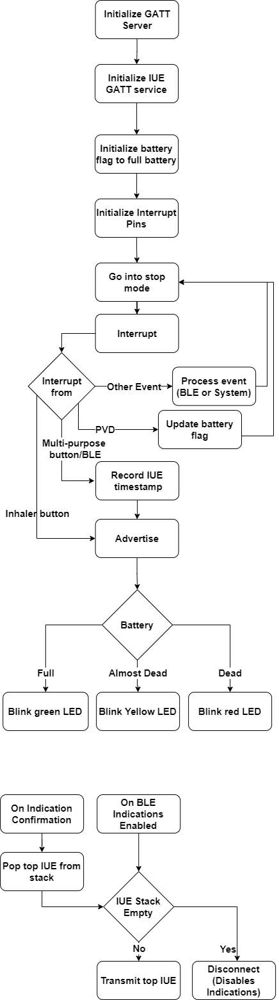

# Inhaler

To understand the inhaler code, you need to familiarize yourself with the sequencer, the Timer Server, and ST's P2P_Server example. Please read the STM32WB page. It will direct you to good resources to learn how to program this microcontroller.

The Inhaler should record IUEs and send them to the app through BLE. If the phone is not nearby, the inhaler records the IUE in non-volatile memory so it is not lost. The inhaler blinks when it is used. Depending on the input voltage (battery state), the inhaler can blink green, yellow, or red.
TODO: project folder
## Schematics and Hardware

The inhaler is built with the STM32WB55 MCU. The non-volatile memory is 

TODO: 

## Inhaler Behavior

The software for the MCU is interrupt-driven; for the vast majority of the time, the MCU is in stop mode (a low power mode). But when an event happens, the MCU is interrupted out of stop mode to process the interrupt. The above figure illustrates the flow of the code for the inhaler. 

First, the interrupts and RTC are initialized in `main.c`. When CPU2 confirms it has been initialized, the rest of the steps are executed in `inhaler_ble.c`. The Programmable Voltage Detector (PVD) is initialized. The FRAM is hibernated to save energy. Functions are registered as sequencer tasks or timeserver interrupt service routines. Finally, the GATT server is initialized with the following profile:

- Inhaler Service
  - Timer Characteristic with READ and Write properties
  - IUE Characteristic with an Indicate property

The IUE Characteristic is sends IUEs to the Android app. It is currently in use. The "Timer Characteristic" allows an App to **read** or **set** the current clock of the inhaler. It can be used to synchronize the inhaler if in the future the app needs to to that. However, it is not currently used.

Everything after that is through interrupts. When the MCU receives an interrupt, it exits stop mode and processes the interrupt. The cause of the interrupt could be CPU2 to handle BLE related events. That is better documented by ST's resources. Thus, the focus here is only on interrupts specific to our application.

### PVD Interrupt

The first time the PVD registers an interrupt, it changes the battery status to almost dead and sets the PVD again but with a lower voltage threshold. The second time, the battery status is changed to dead and the PVD is disabled.

`pvd.c` and `pvd.h` files contain the PVD initialization, logic, and ISR.

### Button Interrupts

Whenever the multi-purpose button is pressed, tasks are set in the sequencer to start advertising and sending data. If the inhaler is already connected, the advertising task will not do anything other than blinking an LED, but the sending task will transfer data through BLE. If the inhaler is not connected, the sending task will not do anything but the advertising task will advertise make the inhaler connectable. Logically, the advertising and sending tasks are exclusive (only one should run).

When the inhaler button is pressed, it sets a task that records an IUE and the advertising task. The IUE recording task records and IUE and sets the task to send IUEs. Thus, other than recording an IUE in the FRAM stack, the inhaler button is identical to the multi-purpose button.

All of this behavior is in `inhaler_ble.c`. The ISR which sets tasks is the `HAL_GPIO_EXTI_Callback` function. The `record_iue`, `send_iue`, and `adv_start` functions are the tasks mentioned above.

### BLE Callbacks

BLE Callbacks are called because of interrupts from CPU2. Some of those are handled in `app_ble.c` and ST's resources explain them. In `inhaler_ble.c`, there are three callback functions of interest. `Inhaler_On_Connect` and `Inhaler_On_Disconnect` are called when a BLE connection is established or terminated. `inhaler_handler` handles notification related to the GATT server like:
- IUE characteristic Indications enabled
- IUE characteristic Indications disabled
- Server Confirmation (confirms an indication was received by the phone)
- Timer characteristic read request
- Timer characteristic write request

When the inhaler connects, it maintain the connection but will not do anything else. When the inhaler disconnects, it also disabled indications.

When indications are enabled, the `send_iue` task is set so the queue is emptied. The `send_iue` task will send a single IUE only or disconnect the inhaler if there are no more IUEs to send and inhaler is connected. Maintaining BLE connections consume consume a lot of power.

When a server confirmation is received, the `pop_iue` task is set. The `pop_iue` task pops a single IUE and sets the `send_iue` task. This ensures a IUE will only be popped if it was received.

## FRAM Stack

The FRAM is non-volatile memory in the form of a byte array. The FRAM code is in `FRAM.c` and `FRAM.h`. It uses some functions from `inhaler_utilities.c`. It uses `SPI1` and `PA4`, so these are initialized in `main.c`. To understand the FRAM code, you need to read its [datasheet](stm32wb/datasheets/FRAM Datasheet.pdf). 

IUEs are recorded in the FRAM in a stack. A stack is an appropriate data type to store IUEs because it is simple and sends the most recent IUEs first. The size of the stack is placed in a super block at memory address 0x000000 in the FRAM too. The IUEs are stored starting from 0x000004. This makes the FRAM a non-volatile single source of truth.

Implementation-wise, the size of the stack is actually cached in memory in a static global variable. This is an optimization to make reading the size of the stack faster. But the size of the stack is written to the FRAM on every edit, so the cached copy is always consistent unless something occurs while writing the size of the stack to the FRAM.

The FRAM consume too much current when it is active, so it is hibernated most of the time. When IUEs are inserted or popped, the FRAM is woken up first and then hibernated again at the end.

Note that if you use a new FRAM, you should clear the FRAM first. You can use the clear function in the `FRAM.c`. Otherwise, the size of the stack will be whatever garbage is stored at address 0x000000.

## RTC setup

The STM32WB has an integrated RTC with calendar support. [This](https://www.youtube.com/watch?v=c6D-IiWSbqA&ab_channel=ControllersTech) video gives a brief overview of the RTC feature. You can find more details in section 29 (RTC) of the [STM32WB55 reference manual](stm32wb\manuals\STM32WB55xx Reference Manual.pdf).

The RTC is configured in `main.c`. The calendar is set using the compile time. You need to set (hard code) the offset from your computer's local system to UTC. At the time of writing this page, Seattle's timezone is UTC -7. Thus, the offset is set to 7 in the `get_compile_time(&sDate, &sTime, 7)` call to get the compile time.

Since the compile time is used to synchronize the inhaler, you might need to clean the project before compiling/flashing it to make sure the compile time is up to date.

`rtc.c` and `rtc.h` are where the RTC logic is written.

## Low Power

The STM32WB Microcontroller has low power modes that can draw a fraction of a micro-ampere. Right now, the inhaler can last for a month on a coin battery. However, it is possible to optimize the inhaler so it lasts much longer.

You can find more details in the [Low Power page](low_power).

TODO: low power branch

## Notes and Advice
