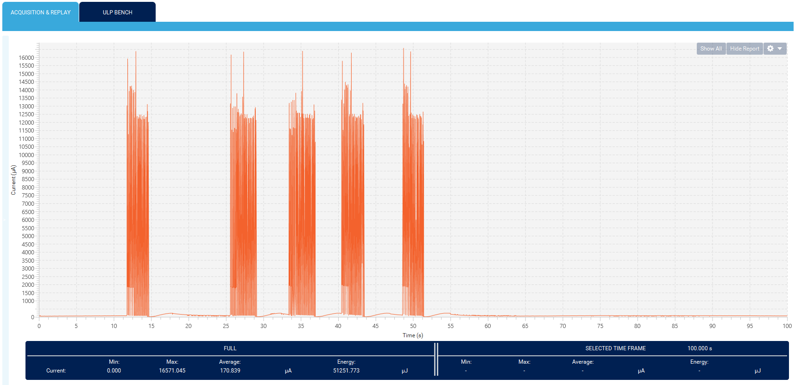

# Inhaler Power

This pages describes how to get the low power version of the inhaler code, how to make power measurements, the current power consumption of the inhaler, and how to optimize the inhaler power consumption even further.

## Making Measurements

There are multiple ways to measure the power consumption of the nucleo board. I will discuss two techniques. The first uses an ammeter and you can power the nucleo board with whatever power source you want. For the second technique, you need to power the nucleo board with the X-NUCLEO-LPM01A expansion board (a power supply with data logging capabilities) which I will refer to as power-board.

I recommend the second technique if you have the power-board and want to make careful measurements. I used the first technique when I didn't have the power board or when I wanted to quickly check the power consumption while I was programming

### The first technique

For this technique, you need an ammeter but you can power the nucleo board with any power source you want.

As described in the readme doc of the **PWR_STANDBY_RTC** example,
- remove all jumpers on connector JP5 (circled in black in below image) to avoid leakages between ST-Link circuitry and STM32WB device.
- remove jumper JP2 (circled in blue in below image) and connect an ammeter to measure current between the 2 connectors of JP2.


Be careful with this technique. The current can be anywhere from around 20mA to around 0.3uA (or even less). This is problematic because most ammeter don't support this measurement range or support it under different modes (a mode for mAs and another for uAs).

If an ammeter measures currents in this range in multiple modes, be aware that you will not be able to measure fractions of uAs while the ammeter is in mA mode. Your readings will always be 0 or too inaccurate. But the nucleo board should work.

On the other hand, if you put the ammeter in the uA mode, once the nucleo board attempts to draw mAs, the ammeter will not be able to handle that high current. Weird things start happening. For my multimeter, it simply didn't allow that much current and the nucleo board was left in an invalid state.

When I to measure the power consumption using this technique, I made sure to switch between the mA and uA of the ammeter as the nucleo board entered/exited a low power mode.

If your ammeter can't measure mAs to uAs in the same mode, I don't recommend this technique.

### The second technique

For this technique, you must use the power-board to power the nucleo board. You can find more about the power-board from its [manual](stm32wb\recommended\Power Measuring Board.pdf).

You can use the power-board on its own or through the [STM32CubeMonitor-Power](https://www.st.com/en/development-tools/stm32cubemonpwr.html) software. If you want to use STM32CubeMonitor-Power, you also have to download the [STSW-STM32102](https://www.st.com/content/st_com/en/products/development-tools/software-development-tools/stm32-software-development-tools/stm32-utilities/stsw-stm32102.html) driver.

To use the second technique,
- remove all jumpers on connector JP5 to avoid leakages between ST-Link circuitry and STM32WB device.
- remove all jumpers on connector JP2 because none of the power options will be used
- remove all jumpers on connector JP1 because none of the power options will be used


Then you can connect two wires (GND and VDD) to the power-board's CN14's pin 1 and 3 respectively as seen below.


Connect the GND pin to any GND pin of the nucleo board. The two I used are pointed to by an arrow as you can see below. Connect the VDD wire to the **AVDD** pin (not to VDD) or pin 7 in CN10. 

This technique was described in the power-board's manual.

## Inhaler power measurements

This is the documentation for the power consumption of the inhaler. I used the power-board (the second power measurement technique) along with the STM32CubeMonitor-Power software. Unless otherwise mentioned, all these current measurements were at 3V, during a span of 100 seconds, and with a 100 KHz polling rate.

All of the following measurements are inclusive of both the nucleo board and the PCB shield.

You need to checkout the `inhaler-low-power` branch. If you updated the master branch, then you need to rebase the `inhaler-low-power` branch on top of the master branch. The `inhaler-low-power` branch disables debugging to allow the low power mode to run. It only changes few lines of **configuration** code. However, I don't recommend developing without debugging tools, so only use the `inhaler-low-power` branch when you want to deliver the inhaler or test its power consumption.

### A) Idle nucleo board without a BLE connection

This is the power consumption of the inhaler when it is not BLE connected and is not used. This is the state the inhaler is in almost all the time. This idle power consumption can be reduced down to 0.6uA (3 orders of magnitude).

File: "docs\measurements\100s + no uses + no connection.stpm"


### B) 5 uses of the inhaler without any successful connections

Each plateau is an inhaler usage. The inhaler advertises for 10 seconds after every inhaler usage. An LED blinks a few times after the inhaler is used. The power consumption can be optimized by using lower power LEDs, blinking the LED for shorter durations, and advertising for a shorter amount of time.

File: "docs\measurements\100s + 5 uses + no connection.stpm"


### C) Idle nucleo board with a BLE connection

This is the power consumption of inhaler when it is not used but is connected to a phone. This demonstrates that maintaining a BLE connection is a power intensive task.

File: "docs\measurements\100s + no uses + connection.stpm"


### D) 5 uses of the inhaler with a continuos BLE connection

This is not how the inhaler currently behaves, but rather an overestimation of its power consumption.

As demonstrated before, maintaining a BLE connection is a power intensive task. In this measurement, the inhaler never disconnects from a phone (which is not the actual case) but remains connected whether it is used or not. In reality, the inhaler disconnects as soon as it sends all IUEs.

File: "docs\measurements\100s + 5 uses + continuos connection.stpm"


### E) 5 uses of the inhaler with disconnections after use

This is an accurate measurement of the system consumption. This was measured while the inhaler was working with our *Breathe* app. The inhaler sends an IUE and disconnects once there are no more IUEs to send to save power.

It is still an overestimation because 5 uses in 100 seconds is too many.

File: "docs\measurements\100s + 5 uses + disconnection optimization + app.stpm"



### Estimated battery life

I will assume a battery capacity of 200 mAh which is an underestimation of [Farnell's 210mAh](stm32wb/datasheets/farnell_cr2032.pdf) and [Energizer's 235mAh](stm32wb/datasheets/energizer_cr2032.pdf).

From **E**, we get the average power consumption as 170.8 uA. STM32CubeMonitor-Power integrates the graph to get an accurate average.

```
(200 mAh) / (0.1708 mA) = 1170.96 h

(1170.96 h) / (24 h/d) = 48.79 days

```

The inhaler should be able to work off a battery for a month. And even that is an underestimation. Since the inhaler will remain idle most of the time, a battery should be able to power the inhaler for a few months.

## Power Optimizations

The inhaler has the potential to consume less power by up to three orders of magnitude. In this section, I explain current optimizations and possible future steps.

### Current Optimizations
- The FRAM consumes too much power when it is active, so it is always kept in hibernate mode. The "docs\measurements\without fram hibernation.stpm" file shows that the FRAM consumes at least 0.5 mA. From observation, I was its power consumption in active mode go up to 2.5mA or so.
- As soon as an IUE is sent, the inhaler terminates BLE connections to save power.
- Debugging features must be disabled to use the low power mode

### Potential Optimizations
- Rather than simply cutting BLE connection when there are no IUEs to sent, have the inhaler go into standby mode as shown in the **PWR_STANDBY_RTC** example
  - Be aware the inhaler starts from the top of main every time it wakes from standby mode.
- There is no need for a PCB
  - There are 32KB of SRAM2A that are retained even during standby mode. Use those instead of an FRAM
  - When the system is powered by a rechargeable batter, you can set it up so the MCU never loses power, so the data in SRAM2A should never be lost
  - The debouncing IC is unnecessary and can be replaced with software.
- Try to connect all the peripherals to the same port.
  - Every port needs a clock, and this consumes power
- Investigate other reasons the idle power consumption of the current inhaler is around 60uA rather than the 4uA of the **P2P_Server** example
- Consider lowering the clock speed of the MCU
  - There is a tradeoff between lowering the clock speed and keeping the clock speed high so the MCU finishes its computations quickly and goes into a low power mode
  - This is one of the last optimizations you should worry about


To get the low power version of the code, you need to checkout 